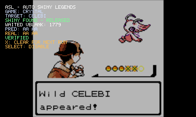

# ASL-AutoShinyLegends

ASL (Auto Shiny Legends) is a standalone raw `.3gx` plugin for the Nintendo 3DS Virtual Console releases of **Pokémon Red, Blue, Yellow, and Crystal**.

It automatically searches for shiny-compatible legendary encounters by waiting for the correct natural RNG/VBlank state. ASL does **not** write generated DVs and does **not** write RNG state.

Starting with **ASL 2.0.0**, the same `default.3gx` automatically detects whether it is running in a supported Generation I or Generation II game and selects the appropriate backend.

<p align="center">
  <table>
    <tr>
      <td align="center">
        
      </td>
      <td align="center">
        
      </td>
    </tr>
    <tr>
      <td align="center">
        <sub>Gen I — verified shiny-compatible legendary encounter</sub>
      </td>
      <td align="center">
        <sub>Gen II — verified shiny Celebi encounter</sub>
      </td>
    </tr>
  </table>
</p>

<p align="center">
  <strong>
    Automatically search for shiny-compatible legendary encounters
    and verify the generated DVs.
  </strong>
</p>

## Installation

1. Build or download `default.3gx`.
2. Open the SD card and go to:

   ```text
   /luma/plugins/
   ```

3. Copy `default.3gx` into that folder.

ASL detects the running game automatically — there are no separate Gen I and Crystal builds.

## Supported games

| Generation | Supported encounters |
| --- | --- |
| Gen I | Articuno, Zapdos, Moltres, Mewtwo |
| Gen II | Celebi |

## How it works

ASL does not force a shiny result by writing DVs into memory.

Instead, it predicts the DVs that the game will naturally generate from its current RNG state. If the upcoming result is not shiny-compatible, ASL allows exactly one real VBlank to occur and checks again.

When a valid shiny-compatible RNG state is found, ASL releases the game and lets the original game code generate the encounter normally.

After generation, ASL reads the real DVs back and compares them with the prediction.

<p align="center">
  
  
</p>

<p align="center">
  <sub>
    ASL stays out of the way until a supported encounter is detected,
    then searches one real VBlank at a time.
  </sub>
</p>

## Features

- One `default.3gx` for supported Gen I and Gen II games.
- Automatic Red / Blue / Yellow / Crystal detection.
- Automatic shiny-compatible legendary search.
- One-real-VBlank-at-a-time RNG advancement.
- No direct writes to generated DVs.
- No direct writes to RNG state.
- No repeated `BattleRandom` reroll loop.
- Post-release `PRED` vs `REAL` DV verification.
- Transparent framebuffer HUD.
- `SELECT` enable/disable toggle.
- `X` abort/reset control.
- Fail-open behavior when a supported layout or signature is not detected.
- No CTRPluginFramework dependency.

## Controls

| Button | Action |
| --- | --- |
| `SELECT` | Enable / disable ASL |
| `X` while searching | Abort the search and release the game |
| `X` after a result | Clear the result and prepare for the next encounter |

ASL starts enabled by default.

## Why `PRED` and `REAL` matter

`SHINY FOUND - RELEASED` means ASL predicted that the game's next natural DV generation would be shiny-compatible and stopped holding the encounter.

`PRED` shows the DV bytes predicted before release.

`REAL` shows the DV bytes actually written by the game afterward.

`VERIFIED` is displayed only when the result generated by the game matches the expected shiny-compatible result.

This makes it easy to distinguish a correctly predicted natural encounter from a timing mismatch.

## Build

Requirements:

- devkitPro
- devkitARM
- the same raw 3GX build tools used by the original ASL project

Build with:

```bash
make clean
make verify
```

The output is:

```text
default.3gx
```

## Compatibility

ASL depends on specific Nintendo 3DS Virtual Console emulator layouts and specific guest ROM layouts.

The plugin validates the expected hooks/signatures before enabling a backend. If the expected layout is not found, ASL fails open instead of blindly patching unknown code.

Generation I and Generation II use separate backends so changes to Crystal support do not alter the timing-sensitive Gen I search path.

## Project layout

```text
include/
source/
    asl_gate.c          Common backend router
    asl_gen1.c          Red / Blue / Yellow backend
    asl_gen2.c          Crystal / Celebi backend
    asl_overlay.c       HUD rendering
    asl_runtime_hooks.c 3DS framebuffer / input hooks
docs/
    images/
```

## Notes

ASL is designed around natural RNG progression.

The goal is not to manufacture DVs, but to wait until the game reaches a state where its own original RNG code will produce a shiny-compatible encounter.

Because the search advances one real VBlank at a time, search duration varies naturally from encounter to encounter.

## License

GPL-3.0. See [LICENSE](LICENSE).