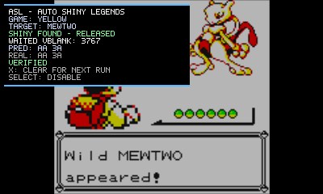
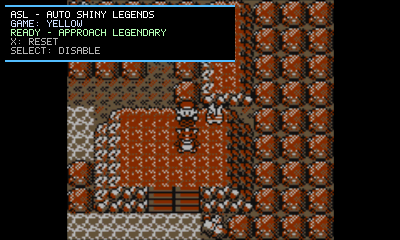
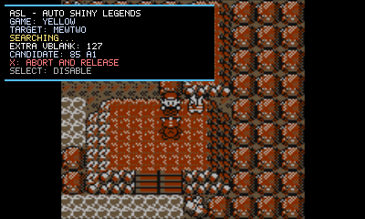

# ASL-AutoShinyLegends

**ASL (Auto Shiny Legends)** is a standalone raw `.3gx` plugin for the Nintendo 3DS Virtual Console releases of **Pokémon Red, Blue and Yellow**.

It automatically searches for shiny-compatible DVs during supported
legendary encounters without modifying the generated DVs or RNG state.

<p align="center">
  
</p>

<p align="center">
  <strong>Automatically search for shiny-compatible legendary encounters and verify the generated DVs.</strong>
</p>

<p align="center">
  
  
</p>

The current build supports:

| Pokémon | Gen I internal species ID |
| --- | ---: |
| Moltres | `0x49` |
| Articuno | `0x4A` |
| Zapdos | `0x4B` |
| Mewtwo | `0x83` |

The project is fully standalone and does **not** depend on CTRPluginFramework.

## Features

- Pokémon Red, Blue and Yellow ROM detection.
- Mewtwo, Articuno, Zapdos and Moltres static-encounter support.
- DIV / `hRandomAdd` prediction without writing RNG state, DVs, WRAM or HRAM.
- One-real-VBlank-at-a-time hold at the game's existing `DelayFrame`.
- Post-release `PRED` vs `REAL` DV verification.
- `SELECT` enable/disable toggle with true gate pass-through while disabled.
- `X` abort/reset control.
- Automatic state reset after:
  - the in-game `A+B+START+SELECT` soft reset;
  - the Virtual Console menu **Reset** action.
- Lightweight framebuffer overlay and HID input hooks.
- No framework menu, framework renderer or framework hook runtime.

## Controls

| Button | Action |
| --- | --- |
| `SELECT` | Enable or disable ASL. The toggle is applied on release so the Gen I soft-reset chord cannot toggle the plugin accidentally. |
| `X` while searching | Abort the hold and release the battle. |
| `X` otherwise | Clear the current result and return to `READY`. |
| `A+B+START+SELECT` | Game soft reset; ASL clears the current run state while preserving ON/OFF. |

The Virtual Console menu **Reset** is detected from the guest game's initialization sequence and also clears only the current run state.

## How it works

ASL does not force a shiny value into memory. Instead, it hooks the emulator helpers used for Game Boy `LDH A,(a8)` and `LDH (a8),A` operations.

At the exact final `DelayFrame` inside `PlayBattleMusic`, the plugin samples the emulator's divider phase and `hRandomAdd`, predicts the two upcoming `BattleRandom` results that become the enemy DVs, and checks whether that DV pair is shiny-compatible after transfer to Gen II.

If the prediction is not shiny-compatible, ASL changes only the return value of the single `hVBlankOccurred` read from `0` to `1`. The game's own `DelayFrame` therefore performs another normal HALT/VBlank iteration. Once the prediction is shiny-compatible, the real `0` is passed through and battle initialization continues normally.

After release, ASL waits for the next validated VBlank and reads the generated enemy DVs from WRAM to verify that the prediction matched reality.

For the low-level hook design and reset-detection details, see [docs/ARCHITECTURE.md](docs/ARCHITECTURE.md).

## Build

Requirements:

- devkitPro / devkitARM
- libctru
- `3gxtool`

From a devkitPro MSYS2 shell:

```sh
make clean
make verify
```

Successful output:

```text
ASL-AutoShinyLegends.3gx
```

## Compatibility

This is intentionally targeted code. The host/emulator addresses, hook signatures and timing constants are for the VC build used during development. The plugin validates the critical ARM hook sites before patching and fails open when they do not match, but a different VC revision may still require new addresses or timing measurements.

Supported guest ROM titles are currently:

- `POKEMON RED`
- `POKEMON BLUE`
- `POKEMON YELLOW`

## Project layout

```text
include/
  asl_gate.h           Public gate state/UI interface
  asl_game.h           Game layouts and supported legendary species
  asl_input.h          HID shared-memory sampling
  asl_overlay.h        Overlay renderer interface
  asl_platform.h       Raw process/patching helpers
  asl_predictor.h      Pure DIV/RNG prediction interface
  asl_runtime_hooks.h  Framebuffer/HID hook installer
source/
  asl_gate.c           Gate state machine and F0/E0 emulator hooks
  asl_game.c           Red/Blue/Yellow constants and species helpers
  asl_input.c          Button edge/held-state tracking
  asl_overlay.c        Direct framebuffer renderer and 5x7 font
  asl_platform.c       Pattern search, debug output and physical alias helper
  asl_predictor.c      Divider reconstruction and shiny-DV prediction
  asl_runtime_hooks.c  Portable framebuffer-present and HID mapping hooks
  bootloader.s         Raw 3GX entry/host-register preservation
  csvc.s               Custom SVC wrappers required by raw patching
  main.c               Minimal initialization entrypoint
```

## Design goals

- Keep game behavior as close to stock as possible.
- Fail open if prediction or hook assumptions are not valid.
- Keep build-specific constants isolated and documented.
- Keep UI/input code separate from the timing-critical gate callbacks.
- Avoid framework lifecycle/destructor behavior during title teardown.

## License

GPL-3.0. See [LICENSE](LICENSE).
